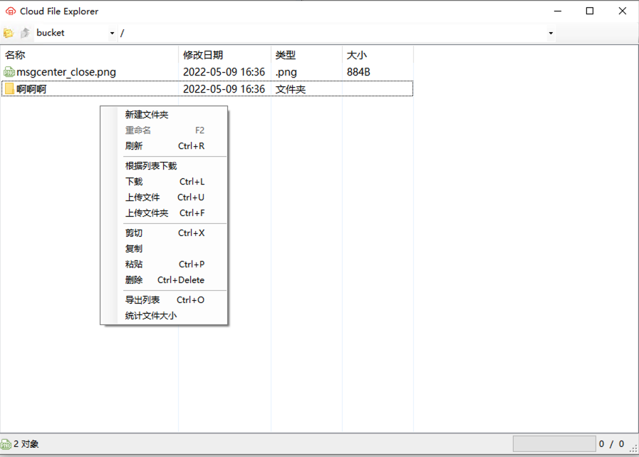

 
 Cloud File Explorer 
 =================
 **从 NetHadoop 升级而来，在保留原有阿里云OSS功能的基础上，增加 腾讯云COS、华为云OBS、七牛云Kodo、Minio自建对象存储。**
 云端文件操作依赖[OnceMi.AspNetCore.OSS](https://github.com/oncemi/OnceMi.AspNetCore.OSS) 版本1.1.5，因部分功能原有项目不支持，故放至本地稍有修改。
 源码地址：[Cloud File Explorer ](https://github.com/gudao/Cloud-File-Explorer)
 功能
 ===========
 - 以最接近本地文件管理器的形式展示云端文件，循环列表展示文件夹内容
 - 上传、下载，支持单文件、多文件、文件夹上传、下载
 - 云端文件直接复制、粘贴、重命名、删除
 - 根据文件列表批量下载文件，即txt中存放预下载文件路径，根据txt批量下载
 - 导出当前文件夹下的所有文件名到txt中
 - 统计云端文件夹中的文件个数和总大小
 - 同文件夹内搜索
 - 支持拖拽上传、下载
 
 预览 
 =========
 
 
 安装
 =========
 暂时只支持 Windows 操作系统。
 需要安装.Net Core 3.1及以上.Net 运行环境。
 修改根目录下的setting.ini文件中的账号信息，然后双击运行压缩包内的CloudFileExplorer.exe
 ``` 
 [Providers]
 Provider="Aliyun" ;Minio/Aliyun/QCloud/Qiniu/HuaweiCloud
 Endpoint ="oss-cn-beijing.aliyuncs.com"
 Region="cn-beijing"
 AccessKey="your key"
 SecretKey="your Secret"
 IsEnableCache="true"
 IsEnableHttps="false"
```
- Provider:根据云存储方案选择对应的选项，Minio/Aliyun/QCloud/Qiniu/HuaweiCloud
- Endpoint：接入点，根据云存储方案确定接入点域名，腾讯云中表示AppId
- Region: 地区

未来计划
==========
- 增加设置密钥界面，不再需要通过配置文件设置密钥
- 增加应用自动更新，应用启动时自动检测新版本并更新
- 增加文件在线预览，图片双击打开、音视频文件在线播放（文件格式待定）、PDF在线预览、Office文件在线预览(格式待定)
- 优化移动、复制速度
- 增加文件管理权限


