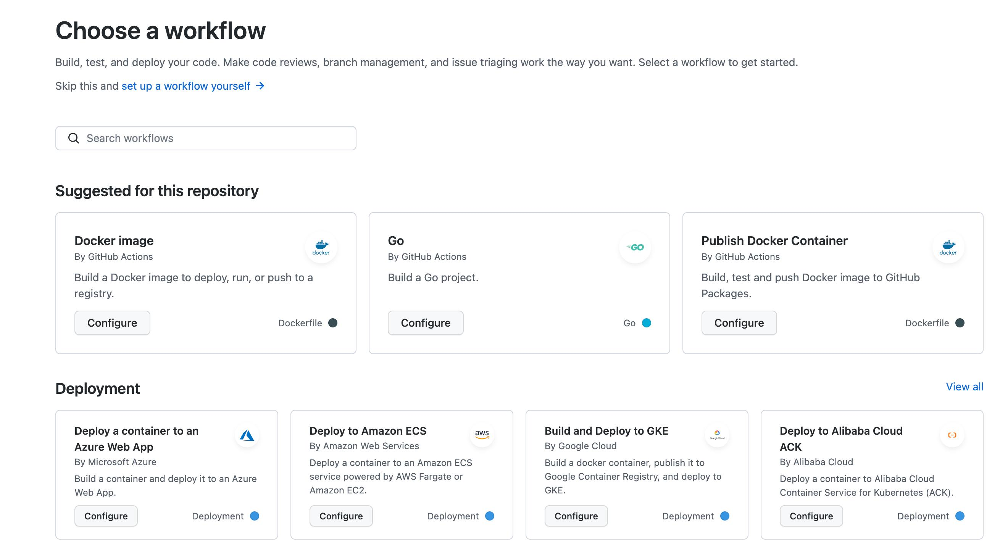

# 缘起
希望通过自动构建把 Golang 项目发布至ECS自建的Docker中。
# 步骤
## Github Action
Github 的Action 中有不少成型的 workflow 可以参考。

利用这些模板可以快速让你了解 Action 语法，如下：
``` yaml
# workflow名称
name: build
# 触发条件，当main分支有推送时或者main分支有pull request 时
on:
  push:
    branches: [ main ] 
  pull_request:
    branches: [ main ]

jobs:
#具体执行内容
  build:
#基于ubuntu操作系统
    runs-on: ubuntu-latest
    steps:
#步骤 签出代码
# 类似这种uses,可以通过 https://github.com/actions/checkout 查看其详情
    - uses: actions/checkout@v2

    - name: Set up Go
      uses: actions/setup-go@v2
# action 中可以自定义一些参数 通过with形式传入
      with:
        go-version: 1.17

    - name: Build
      run: go build -v ./...

    - name: Test
      run: go test -v ./...
```
看上面的注释你应该有了大概的了解，更多入门操作可以看阮一峰的[GitHub Actions 入门教程](http://www.ruanyifeng.com/blog/2019/09/getting-started-with-github-actions.html)
或者[官方的快速入门](https://docs.github.com/cn/actions/learn-github-actions/understanding-github-actions)
我在这里走的弯路主要是【以为所有的操作都可以通过增加 steps 下的name 来完成】。
按照这个思路 将 steps 组织成了这样，`checkout -> setup-go -> build go -> docker build -> acr login-> docker push -> ssh login ->docker run`
以上都是伪代码，大致就是 把代码签出来安装go 依赖，然后build 成可执行文件。将可执行文件 build 至docker 镜像中，然后推送至镜像仓库，最后使用ssh登录到ECS 运行镜像。
结果在docker build 步骤一直报错。可能是我理解问题，以为所有的执行步骤都是在同一个文件夹下执行，所以试图在 go build 出 可执行文件时，直接复制至Docker 中然后打包成镜像，直接推送至阿里云镜像仓库。然而一直没能成功就转向了使用Dockerfile build。

## 构建镜像
最终的dockerfile如下：
``` yaml
FROM golang:1.17 AS builder
# 为我们的镜像设置必要的环境变量
ENV GO111MODULE=on \
    CGO_ENABLED=0 \
    GOOS=linux \
    GOARCH=amd64 \
    GOPROXY=https://goproxy.cn,direct

WORKDIR /builder

# 将代码复制到容器中
COPY . .
# 安装依赖
RUN go mod download

# 将我们的代码编译成二进制可执行文件 app
RUN go build -o app .

###################
# 接下来创建一个小镜像
###################
FROM scratch

# 从builder镜像中把/dist/app 拷贝到当前目录
COPY --from=builder /builder/app /

# 需要运行的命令
ENTRYPOINT ["/app"]

```

因为没有能够在 github Action中实现build image，所以只能利用dockerfile 先在本地先build完再推向镜像仓库了。

## 推送镜像至ACR

因为阿里云有发布 [acr-login](https://github.com/aliyun/acr-login)，就直接使用了。其中的secrets.ACCESSKEY_ID和secrets.ACCESSKEY_SECRET
设置路径在 github 对应 repository 的` Settings -> Secrets -> Actions -> New repository secret`。
Vaule 来自阿里云的头像下拉列表的AccessKey管理菜单。
aliyun/acr-login 还提供了private registry 的登录方式，一定不要选错了。
```
		- name: Login to ACR
        uses: aliyun/acr-login@v1
        with:
          region-id: cn-beijing
          access-key-id: "${{ secrets.ACCESSKEY_ID }}"
          access-key-secret: "${{ secrets.ACCESSKEY_SECRET }}"
```

这里在列举几个你可能用到的action
-  [actions/checkout@v2](https://github.com/actions/checkout) 签出代码
-  [actions/setup-go](https://github.com/actions/setup-go) 安装go环境
-  [actions/setup-node](https://github.com/actions/setup-node) 安装node 环境
-  [actions-hub/docker/login@master](https://github.com/actions-hub/docker) 登录docker
-  [actions-hub/docker@master](https://github.com/actions-hub/docker) 推送到docker hub
-  [appleboy/scp-action@master](https://github.com/appleboy/scp-action) SSH远程登录服务器

## 拉取镜像并运行
```
      - name: Server Start
        uses: appleboy/ssh-action@master
        with:
            host: ${{ secrets.HOST }}
            username: ${{ secrets.USERNAME }}
            password: ${{ secrets.PASSWORD }}
            port: ${{ secrets.PORT }}
            script: |
              docker pull registry.cn-beijing.aliyuncs.com/gudao2008/${{ env.IMAGE_Name }}:${{ env.IMAGE_TAG }}
              docker container stop ${{ env.IMAGE_Name}} || echo "停止容器[${{ env.IMAGE_Name}}]异常"
              docker container rm ${{ env.IMAGE_Name}} || echo "删除容器[${{ env.IMAGE_Name}}]异常"
              docker container run -d --name ${{ env.IMAGE_Name }} -it registry.cn-beijing.aliyuncs.com/gudao2008/${{ env.IMAGE_Name }}:${{ env.IMAGE_TAG }}

```
在这一步遇到的问题是在执行时一直报错，先是因为这里的script 参数不同与action run里的参数格式。action中直接使用$.变量就行了，在script中需要用全局的 ${{}} 包裹才行。
后就开始报`20***/03/08 02:25:11 dial tcp ***:***: i/o timeout` 超时错误，以为是拉取镜像操作超时呢，把镜像仓库都改成了公开，还是无果。后来尝试在服务器上直接运行看是否能成功，结果成功了。才把原因定位到ssh登录超时，改了ECS安全组策略后终于成功了。
## 最后

完整的cli.yml如下,配合上面的dockerfile是可以直接运行的。
```
name: Go

on:
  push:
    branches: [ main ]
  pull_request:
    branches: [ main ]
env:
  IMAGE_TAG: ${{ github.sha }}
  IMAGE_Name: go_template
jobs:

  build:
    runs-on: ubuntu-latest
    steps:
      - uses: actions/checkout@v2

      #      - name: Set up Go
#        uses: actions/setup-go@v2
#        with:
#          go-version: 1.17
#
#      - name: Build
#        run: go build -o app .

      #登录
      - name: Login to ACR
        uses: aliyun/acr-login@v1
        with:
          region-id: cn-beijing
          access-key-id: "${{ secrets.GUDAO_ACCESSKEY_ID }}"
          access-key-secret: "${{ secrets.GUDAO_ACCESSKEY_SECRET }}"

      #打包
      - name: Build and push image
        run: |
          docker build -t registry.cn-beijing.aliyuncs.com/gudao2008/$IMAGE_Name:$IMAGE_TAG .
          docker push registry.cn-beijing.aliyuncs.com/gudao2008/$IMAGE_Name:$IMAGE_TAG

      # 发布 镜像仓库改为公开
      - name: Server Start
        uses: appleboy/ssh-action@master
        with:
            host: ${{ secrets.HOST }}
            username: ${{ secrets.USERNAME }}
            password: ${{ secrets.PASSWORD }}
            port: ${{ secrets.PORT }}
            script: |
              docker pull registry.cn-beijing.aliyuncs.com/gudao2008/${{ env.IMAGE_Name }}:${{ env.IMAGE_TAG }}
              docker container stop ${{ env.IMAGE_Name}} || echo "停止容器[${{ env.IMAGE_Name}}]异常"
              docker container rm ${{ env.IMAGE_Name}} || echo "删除容器[${{ env.IMAGE_Name}}]异常"
              docker container run -d --name ${{ env.IMAGE_Name }} -it registry.cn-beijing.aliyuncs.com/gudao2008/${{ env.IMAGE_Name }}:${{ env.IMAGE_TAG }}

```
## 参考
- [基于Github Action部署Nextjs项目到阿里云ESC](https://blog.51cto.com/youthfighter/4805540)
- [一个实用版本的 Github Actions 持续集成样例](https://www.gitdig.com/post/github-action/)
- [GitHub Actions持续集成阿里云容器镜像服务（ACR）](https://mincong.io/cn/github-actions-acr/)