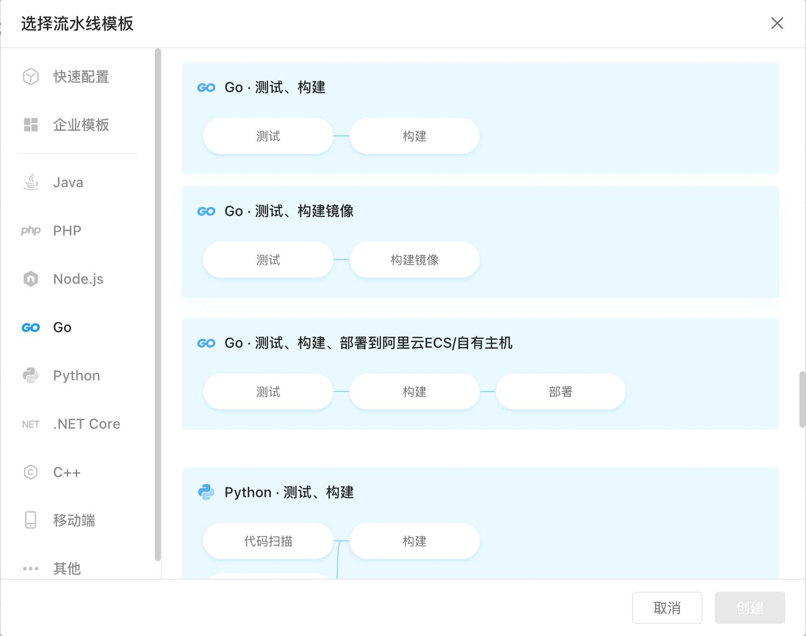

继上一篇用Github Action 部署后，公司内部的站点也陆续实现了自动化部署，因为大部分的中间件都是阿里系列的，所以首先选用的就是云效系列中的`流水线`[地址](https://flow.aliyun.com/)。
「流水线」，又名「Flow」，是一款企业级、自动化的研发交付流水线， 提供灵活易用的持续集成、持续验证、 持续发布功能，帮助企业高质量、高效率的交付业务。
流水线是持续交付的载体，通过构建自动化、集成自动化、验证自动化、部署自动化，完成从开发到上线过程的持续交付。通过持续向团队提供及时反馈，让交付过程高效顺畅。
# 快速入门
相比较自建的持续交付工具，使用 Flow 仅仅需要几步，就可以快速搭建 CICD 流程。官方提供足够多的模板，可以满足日常使用，如果没有合适的基于原有的模板定制也是很顺手的。

你都无需学习文档直接上手就行，拿一个 golang 项目来说吧。
## 1. 基本信息
设置流水线的名称和可以协作的成员，简单到直接忽略就行。
## 2. 流程配置
基本步骤都在这里，几乎所有的CICD都会有这么几个步骤：拉取代码->测试->编译构建->部署构建结果; Java或者nodejs项目可能在测试之前还会有个代码扫描，总之大致流程就是这样。
### 拉取代码
多数的持续集成引擎是利用Runner\Worker 之类的独立环境来执行这一系列的步骤的，所以首要的任务都是先把你的代码拷贝到一个独立的执行环境中。
你可以简单想象成 git clone 到你的本地计算机，Flow 除了支持自家的 codeup 还支持自建的Gitlab、Github、码云等通用的 git 源代码管理工具。
要拉取代码除了填写仓库地址和分支名称，重要的就是认证信息，flow 支持管理认证用户名/密码，第三方授权等方式来方便下次的代码拉取。
### 测试/扫描

### 编译构建
### 部署
### 
## 3. 触发设置
## 4. 变量和缓存
# 项目实践
Golang 
``` Dockerfile
FROM golang:1.17 AS builder
# 为我们的镜像设置必要的环境变量
ENV GO111MODULE=on \
    CGO_ENABLED=0 \
    GOOS=linux \
    GOARCH=amd64 \
    GOPROXY=https://goproxy.cn,direct

# 移动到工作目录：/build
WORKDIR /build

# 将代码复制到容器中
COPY . .

# 复制项目中的 go.mod 和 go.sum文件并下载依赖信息
COPY go.mod .
COPY go.sum .
RUN go mod download

# 将我们的代码编译成二进制可执行文件 app
RUN go build -o app .

###################
# 接下来创建一个小镜像
###################
FROM scratch

# 从builder镜像中把/dist/app 拷贝到当前目录
COPY --from=builder /build/app /

# 需要运行的命令
ENTRYPOINT ["/app"]


```
vue.js
```
# build environment
FROM node:14-alpine as build
WORKDIR /app
#ENV PATH /app/node_modules/.bin:$PATH
COPY package.json /app/package.json
RUN npm config set registry https://registry.npm.taobao.org
#RUN npm config get registry \
# 清除缓存
#RUN npm cache clear --force
# 构建中优先使用缓存中
RUN npm install --prefer-offline --no-audit
RUN npm install @vue/cli-service -g
COPY . /app
RUN npm run build

# production environment
FROM nginx
COPY --from=build /app/dist /usr/share/nginx/html
EXPOSE 80
CMD ["nginx", "-g", "daemon off;"]

```
java
在之前构建
mvn -B clean package -Dmaven.test.skip=true -Dautoconfig.skip
```
# 该镜像需要依赖的基础镜像
FROM openjdk:8-jdk-alpine
# 将targer目录下的jar包复制到docker容器/home/springboot目录下面目录下面
ADD ./target/JavaWebApi-0.0.1-SNAPSHOT.jar /home/JavaWebApi/JavaWebApi-0.0.1-SNAPSHOT.jar
# 声明服务运行在8080端口
EXPOSE 8090

# 执行命令
CMD ["java","-jar","/home/JavaWebApi/JavaWebApi-0.0.1-SNAPSHOT.jar","--spring.profiles.active=prod"]
```
# 便捷之处