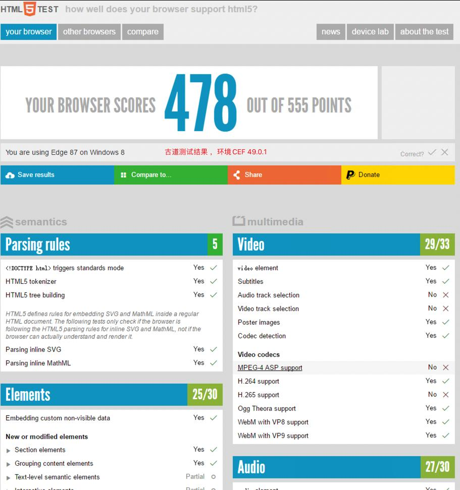
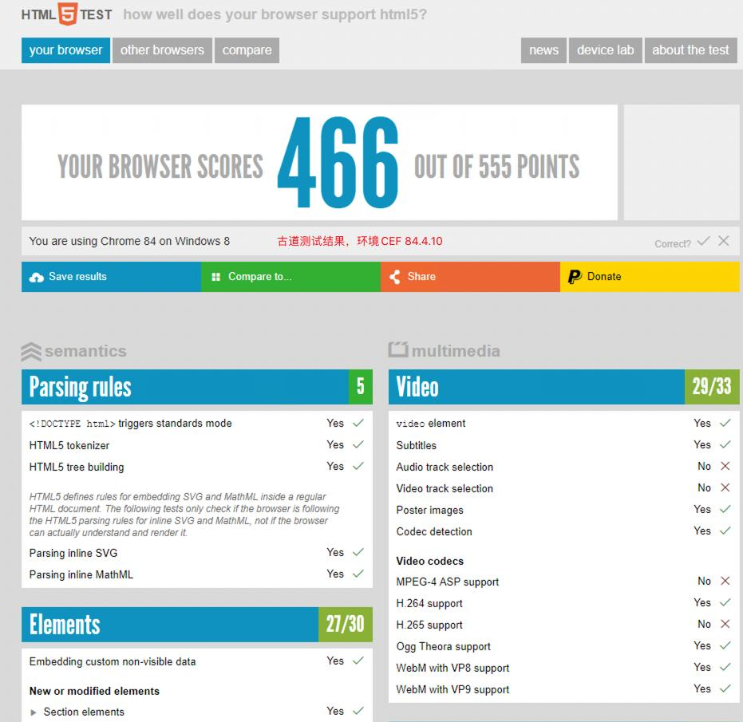
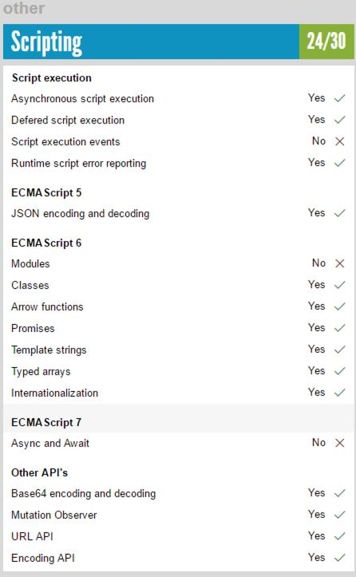
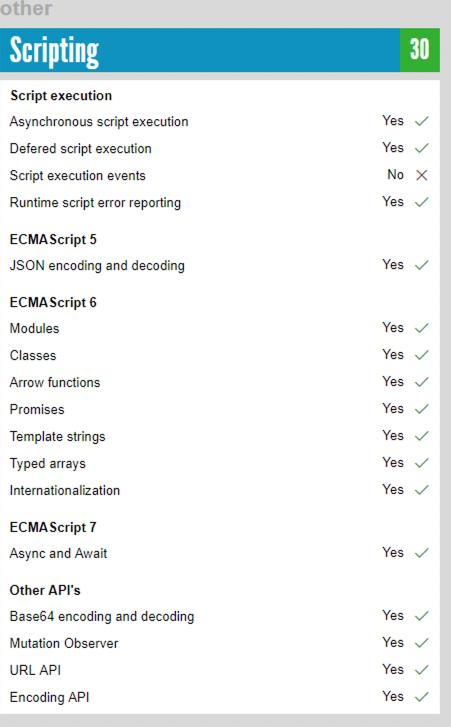
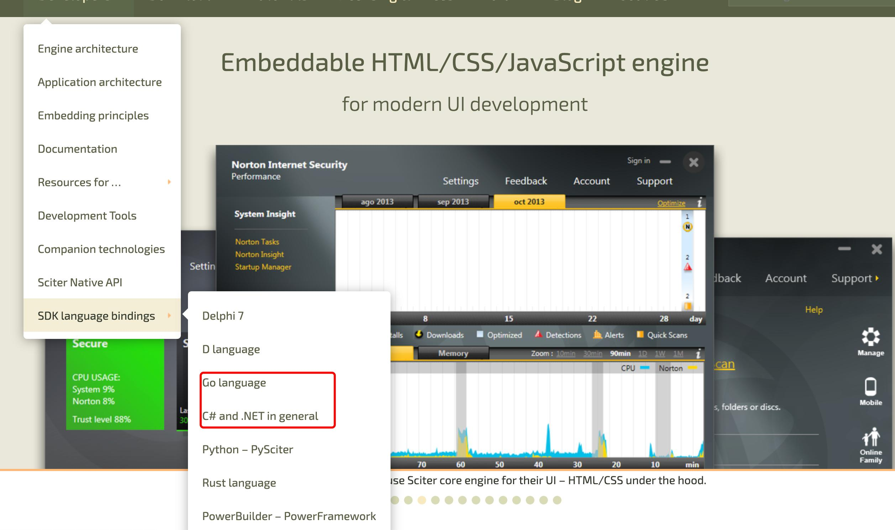

# 最终解决方案
最终实现的场景是可以在`Windows 7`及以上版本的Windows操作系统上运行一个`开机自启动的全屏浏览器`，同时支持` HTML5语法`、`MP4格式（H264编码）视频播放`、`Flash播放`。
为了有相关需求的朋友快速找到解决方案，我先把结果放上来，可以直接运行就能继续忙别的重要的事情了。
下载地址在CSDN，因为最终的可以运行的版本我也是从这里下载的。[下载地址](https://download.csdn.net/download/gudao119/85132859)

文件包里同时包含了CEF 49.0.1 和 CEF 84.4.10 两个版本，区别在于
84.4.10 的版本依赖环境 .Net Framework 4.6.1 ，是在Windows 10 下编译的，而 Win7 虽然可以安装相应版本的 Framework 却不能修改对应的Windows SDK 导致最终不能正常运行。
如果你的需求环境支持 Windows 10 建议使用更高版本的CEF，49 和 84 在 [HTMT5TEST](https://www.html5test.com) 的整体得分分别为 478 和 466，虽然总分让人意外但是细看下面的支持项
尤其在 javascript 支持上来看，还是新版本的支持的比较好，如果想在语法上使用些比较新的语法糖，个人建议还是用84的。

# 趟坑开始
如果你想更详细了解故事的原委请继续。
2017时有个应用需要开机启动一个全屏的浏览器，内嵌一个html写的网站，要求播放mp4视频和播放swf格式的游戏。当时找的解决方案是用
一个名为 NetDimension.NanUI.dll 的类库（后来查了一下竟然还在更新迭代，感兴趣的可以了解）底层依赖的其实是CEF 3.2987.1601。
估计当时只知道CEF为了规避 `H264/AAC 被归类为专有编解码器不受支持，它们需要您获得许可证。` 不能直接支持H264编码的视频。（详细内容请查看[Information about the H.264 patent license](https://www.fsf.org/licensing/h264-patent-license)）
所以没有多想，毕竟需求里也有swf格式的游戏，就直接选用了flash来播放MP4，播放器是用的jwpalyer 6.7 ，虽然播放起来有点慢但是终究还是可以实现的。
# 多年以后 
时隔5年，总觉得之前的方案不满意，客户的用户体验也被现在的科技教育的越来越不能容忍之前的凑合，于是开始探索 GUI 可行方案的崎岖之路。
## 寄予 Golang 希望 
从了解 Golang 到现在一直对 Go 的简洁一直崇拜，于是想在Go 语言下找到一条通用 GUI 的解决方案之路，结果还是现实让我碰了一鼻子灰。
我先你点开这个地址[A list of Go GUI/graphics/image related projects](https://github.com/go-graphics/go-gui-projects)看看，github上列出来的一个 Go 语言在GUI方面的开源项目。
从 `原生（native GUI and utility bindings）` 到 `基于HTML（HTML based GUI）`再到`2D \ 3D (2D vector graphics and computing APIs \ 3D graphics and computing API bindings)` 着实的让我花费了不少时间尝试他们的可行性。
***SCITER*** 花费我时间最多是[SCITER](https://sciter.com/) 在尝试了种种方案中让我觉得最靠谱，文档相对比较完善的就数它了，再加入人家在杀毒应用界的成功案例，让我兴奋了好几个晚上都夜不能寐。
官方支持了我熟悉的C#和Go两种语言，心想怎么也得搞定吧。
花了2天的时间先把Sciter.TIS和javascript的语法学完了，看这里[JavaScript, Dart/Chrome and TIScript/Sciter comparison 三种语言的区别对比](https://sciter.com/docs/js-dart-tis.html)。
正要兴致勃勃地开始开发时，无情的被IDE折磨了几天，实在受不了最终放弃了。官方虽然提供了不少推荐的IDE[Development Tools](https://sciter.com/developers/development-tools/)，包括自家的`Sciter’s DOM Inspector`,
但是在我修改代码后不能刷新页面看效果，而需要重启Inspector才能看到效果，经历了大几百次后，我崩溃了。自己的编程能力真的不能跟老外比，人家可以在编辑器（注意是编辑器不是IDE）下生生的敲出来，不用网络不用智能提示，敲完一大段后直接run一下，通过了。
***WebView** [Webview](https://github.com/webview/webview),Tiny cross-platform webview library for C/C++/Golang. Uses WebKit (Gtk/Cocoa) and Edge (Windows)。像介绍说的那样windows环境是以Edge为内核，Mac下是WebKit为内核的，
虽然应用都正常打开，页面也能正常打开就是js支持情况太差了，连Array.Foreach都不支持，需要用for代替，Flash插件就没再测试。
对了，还有大名鼎鼎的[Electron](https://github.com/asticode/go-astilectron)Build cross platform GUI apps with GO and HTML/JS/CSS (powered by Electron),因为打包的后的大小问题，也放弃。
## 重返 CEF 的怀抱
各种尝试后真实苦恼，又尝试找CEF的新版本，偶然发现虽然CEF官方不支持H264,其实是可以自己增加编译参数。于是找到了文章开头提到的几个版本的民间编译版。
相对更全编译版本在这都这[Chromium Embedded Framework (CEF) Automated Builds](https://cef-builds.spotifycdn.com/index.html)
包括现在最新的100版本都已经有了，包含Linux、MacOS、Windows的32bit\64bit\ARM64。
# 依赖检查
Win7安装运行也遇到了不少问题，运行应用就意外停止。
+ windows7 安装.net framework 4.6。
	提示证书不收信任，按步骤做了也不生效的。[已处理证书链,但是在不受信任提供程序信任的根证书中终止-Windows 7安装.Net Framework 4.6.2](https://blog.csdn.net/inchat/article/details/104294302)
	更换证书文件的，换了依旧提示不行的。[Microsoft Root Certificate 2011.cer](https://answers.microsoft.com/en-us/windows/forum/all/microsoft-root-certificate-2011cer/4a6aca92-fa7b-40a2-959d-4c440f3ec91d?auth=1)
	让你关闭更新服务的，甚至还有专门关闭服务的软件[Windows Update Blocker v1.7 ](https://www.sordum.org/downloads/?st-windows-update-blocker)，也[不可行](https://www.hanboshi.com/articles/5063.html)
	最后安装成功其实是安装了一个windows7的补丁包，才可以了。[用于基于 x64 的系统的 Windows 7 安全更新程序 (KB2813430)](https://www.microsoft.com/zh-CN/download/details.aspx?id=39115) 和 [时间戳签名和或证书无法验证或已损坏（已解决）](https://blog.csdn.net/qq_34100267/article/details/117095483)
+ .net framework 装上了还是不行，启动就自动停止。Windows7环境下运行应用报“CLR20r3”错误。查到的所有结果都是告诉你.netframework 没有安装。其实原因不在这，是因为cesharp.winform 依赖的两个c++库是在windows10 SDK 下编译的。
+ 当时还猜测是VC++依赖没装呢，安装了[Visual C++ Redistributable Packages for Visual Studio 2013](https://www.microsoft.com/en-us/download/details.aspx?id=40784)，还是不行就没有再尝试。
+ 偶然发现了一块神一样的工具，[Dependency Walker](https://www.dependencywalker.com/)，可以选中一个dll查看当前机器上针对该dll缺少的依赖。运行后一下就找到原因。

下面主要说一下排查问题的思路，这种没法在客户端同样环境下调试的情况，
+ 查看错误消息，如果能有错误消息内快速定位问题。就怕那种报错和真实原因不符的。
+ 查看windows的事件查看器，学会从中看出端倪。
+ 如果还是不行，建议找些工具来辅助你把问题的错误信息更加详细，只有详细的错误日志才能帮你定位问题。

# 排查问题很磨练意志力
如果长时间没有结果，就想法放空一下自己的大脑吧。跟女朋友打会有游戏，跟爱人刷会网剧，跟孩子做会手工，这些看似跟问题没有关系的事可能会帮助你更快速的找到解决问题的关键。